-   [R and Lego](#r-and-lego)
-   [Gallery of the photos](#gallery-of-the-photos)
    -   [Notes](#notes)

<!-- README.md is generated from README.Rmd. Please edit that file -->
R and Lego
==========

Repo holds photos that depict R data structures and operations via Lego.

These images are released under a [Creative Commons Attribution 4.0 International License](https://creativecommons.org/licenses/by/4.0/).

Gallery of the photos
=====================

Clickable gallery, which is created from a small chunk of R code in an executable R Markdown [`README.Rmd`](README.Rmd). [This gist](https://gist.github.com/jennybc/0239f65633e09df7e5f4) shows similar syntax but with markdown image links, instead of html.

 <a href="lego-rstats_002.jpg">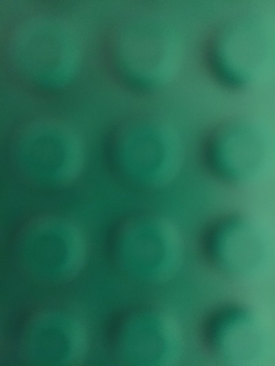</a>  <a href="lego-rstats_004.jpg">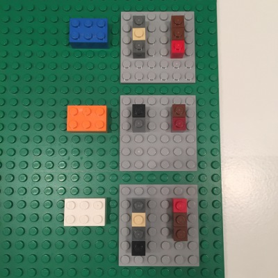</a>      <a href="lego-rstats_010.jpg">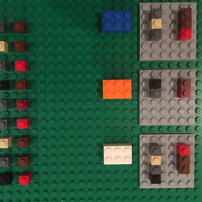</a> <a href="lego-rstats_011.jpg">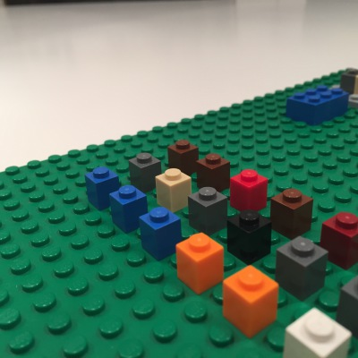</a>  <a href="lego-rstats_013.jpg">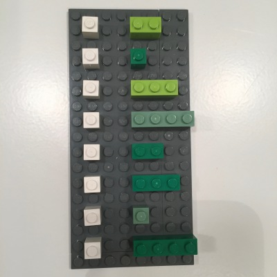</a>  <a href="lego-rstats_015.jpg">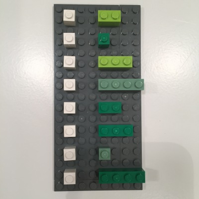</a> <a href="lego-rstats_016.jpg">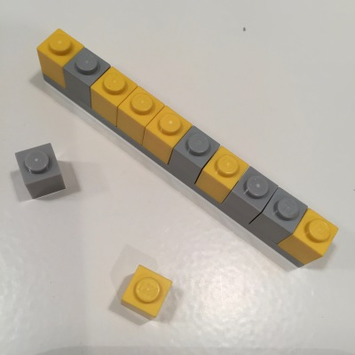</a> <a href="lego-rstats_017.jpg">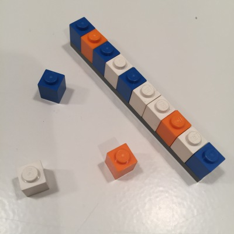</a> <a href="lego-rstats_018.jpg">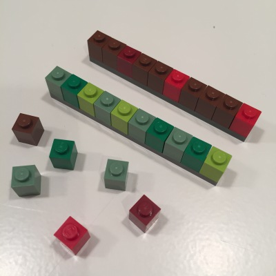</a>   <a href="lego-rstats_021.jpg">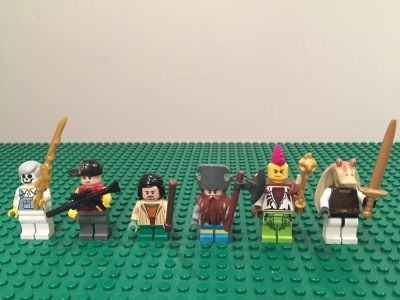</a> <a href="lego-rstats_022.jpg">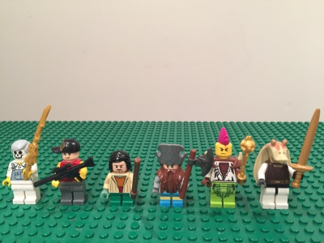</a> <a href="lego-rstats_023.jpg">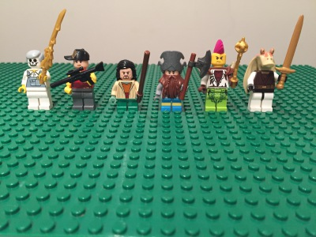</a> <a href="lego-rstats_024.jpg">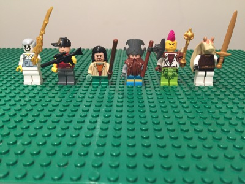</a> <a href="lego-rstats_025.jpg">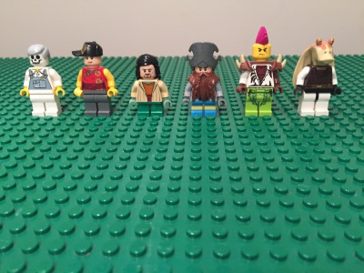</a>   <a href="lego-rstats_028.jpg">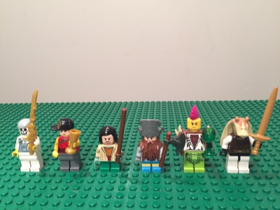</a>  <a href="lego-rstats_030.jpg">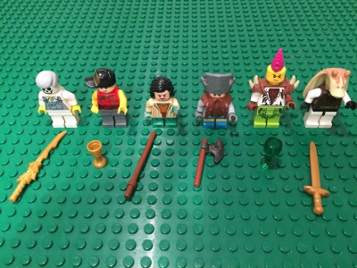</a> <a href="lego-rstats_031.jpg">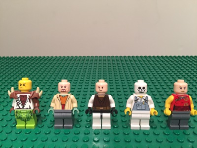</a>          <a href="lego-rstats_041.jpg">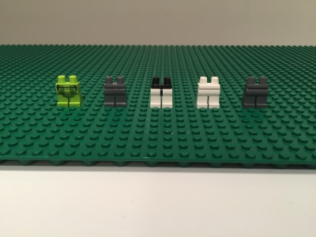</a> <a href="lego-rstats_101.jpg">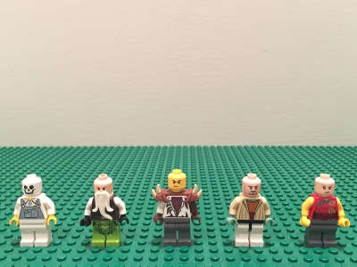</a> <a href="lego-rstats_102.jpg">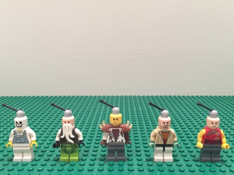</a> <a href="lego-rstats_103.jpg">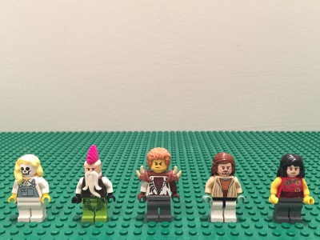</a> <a href="lego-rstats_104.jpg">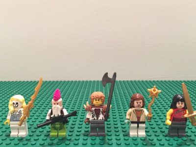</a> <a href="lego-rstats_105.jpg">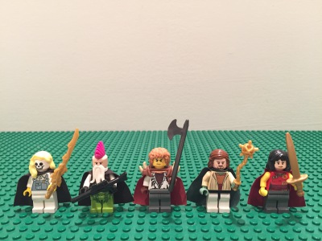</a> <a href="lego-rstats_106.jpg">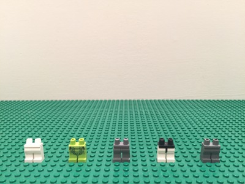</a> <a href="lego-rstats_107.jpg">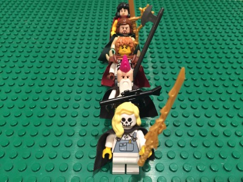</a> <a href="lego-rstats_108.jpg">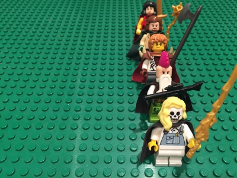</a> <a href="lego-rstats_109.jpg">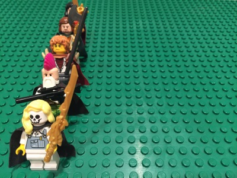</a> <a href="lego-rstats_110.jpg">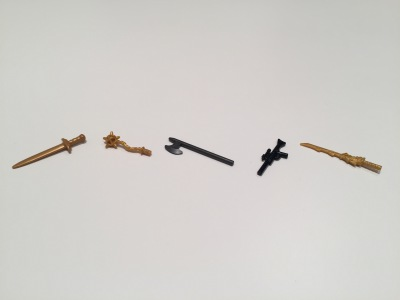</a> <a href="lego-rstats_111.jpg">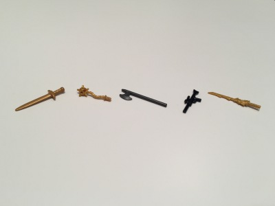</a> <a href="lego-rstats_112.jpg">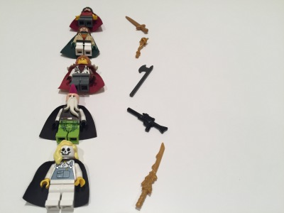</a> <a href="lego-rstats_113.jpg">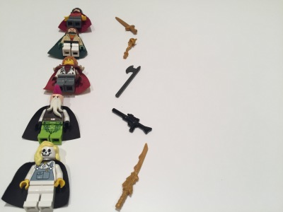</a> <a href="lego-rstats_114.jpg">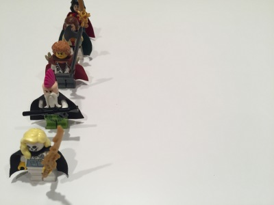</a> <a href="lego-rstats_115.jpg">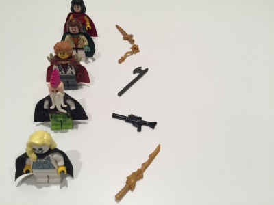</a> <a href="lego-rstats_116.jpg">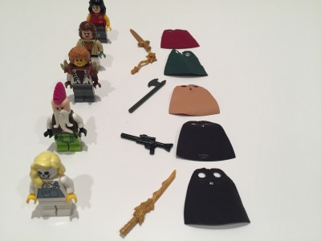</a> <a href="lego-rstats_117.jpg">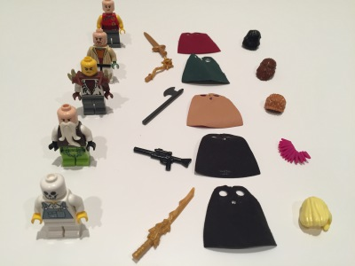</a> <a href="lego-rstats_118.jpg">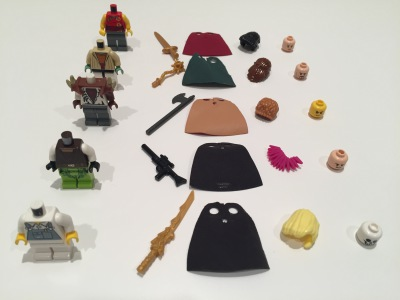</a> <a href="lego-rstats_119.jpg">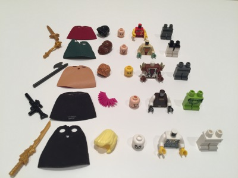</a> <a href="lego-rstats_120.jpg">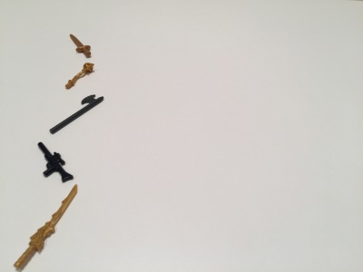</a> <a href="lego-rstats_121.jpg">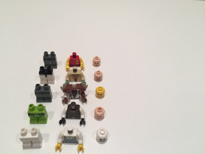</a> <a href="lego-rstats_122.jpg">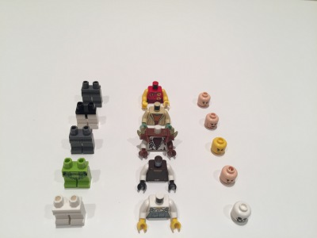</a> <a href="lego-rstats_123.jpg">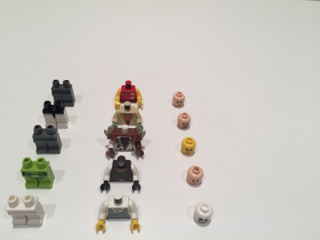</a> <a href="lego-rstats_124.jpg">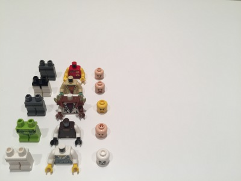</a> <a href="lego-rstats_125.jpg">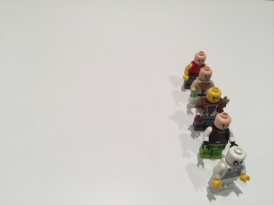</a> <a href="lego-rstats_126.jpg">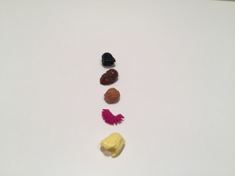</a> <a href="lego-rstats_127.jpg">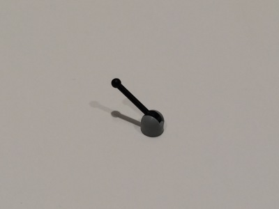</a>  <a href="lego-rstats_129.jpg">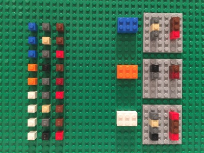</a> <a href="lego-rstats_130.jpg">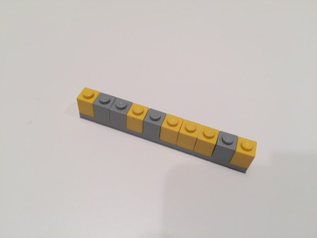</a> <a href="lego-rstats_131.jpg">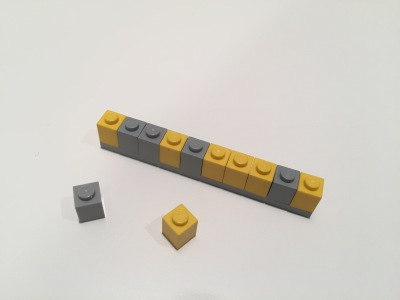</a> <a href="lego-rstats_132.jpg">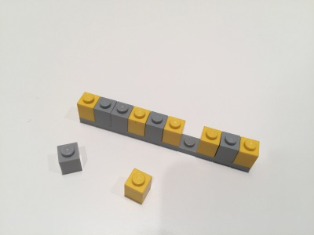</a> <a href="lego-rstats_133.jpg">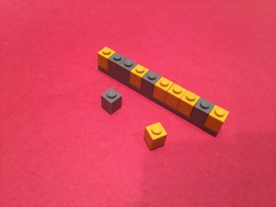</a>                 

### Notes

Photos added in waves and file name/number is roughly chronological. At least I think so.

-   2016-10-23 just playing around, 1st two photos of the large plate
-   2016-11-06 first big wave
-   2016-11-06 redo pants photo due to 2 vs 3 peg gap (wtf?)
-   2016-11-15 have learned alot from first wave
    -   BOUGHT A TRIPOD
    -   retake photos of nested data frame, since david smith discovered a missing lego :scream:
    -   made photos more suitable for map, map2, pmap, map\_df
    -   illustrate NAs in atomic vector
    -   photograph atomic vectors on contrasting construction paper so keynote alpha transparency works
-   TO DOs:
    -   retake antenna photo
    -   map\_SOMETHING when elements aren't valid ... safely?
    -   horizontal hair-only (like the weapons)
    -   columnar white background bald minis, hair, minis w/ hair
