-   [R and Lego](#r-and-lego)
-   [Gallery of the photos](#gallery-of-the-photos)

<!-- README.md is generated from README.Rmd. Please edit that file -->
R and Lego
==========

Repo holds photos that depict R data structures and operations via Lego.

These images are released under a [Creative Commons Attribution 4.0 International License](https://creativecommons.org/licenses/by/4.0/).

Gallery of the photos
=====================

Clickable gallery, which is created from a small chunk of R code in an executable R Markdown [`README.Rmd`](README.Rmd). [This gist](https://gist.github.com/jennybc/0239f65633e09df7e5f4) shows similar syntax but with markdown image links, instead of html.

<a href="lego-rstats_01.jpg">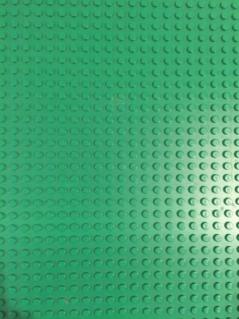</a>  <a href="lego-rstats_03.jpg">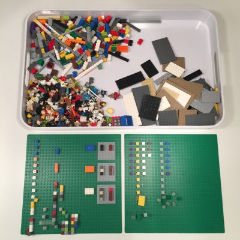</a>  <a href="lego-rstats_05.jpg">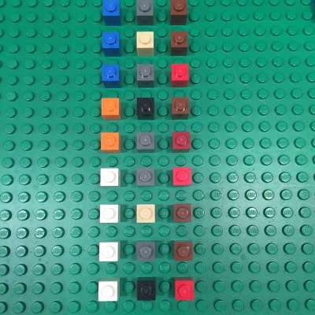</a> <a href="lego-rstats_06.jpg">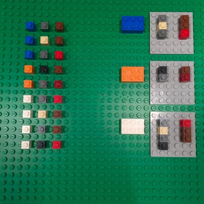</a>  <a href="lego-rstats_08.jpg">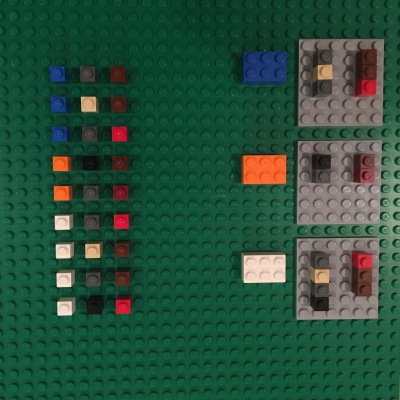</a> <a href="lego-rstats_09.jpg">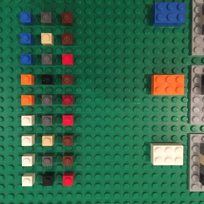</a>   <a href="lego-rstats_12.jpg">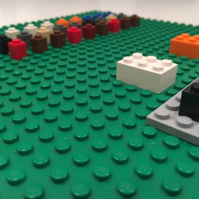</a>  <a href="lego-rstats_14.jpg">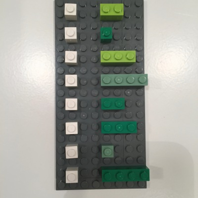</a>     <a href="lego-rstats_19.jpg">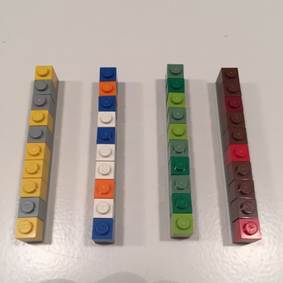</a>       <a href="lego-rstats_26.jpg">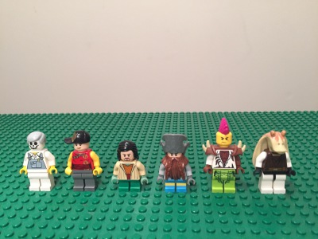</a>       <a href="lego-rstats_33.jpg">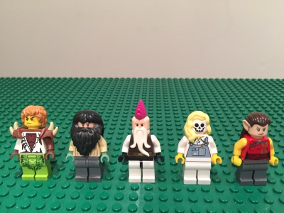</a>   <a href="lego-rstats_36.jpg">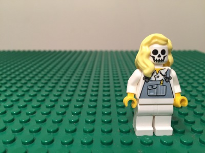</a> <a href="lego-rstats_37.jpg">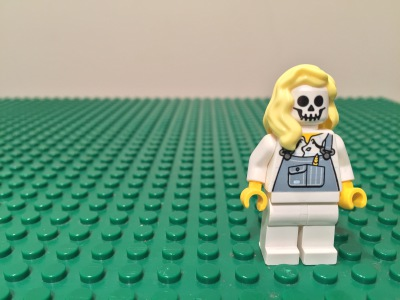</a> <a href="lego-rstats_38.jpg">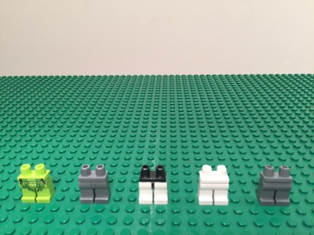</a>  <a href="lego-rstats_40.jpg">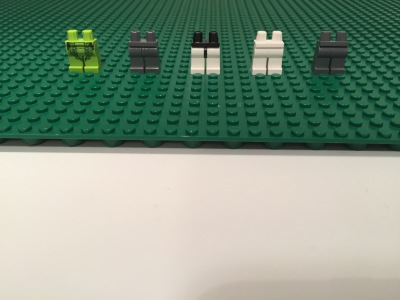</a> 
